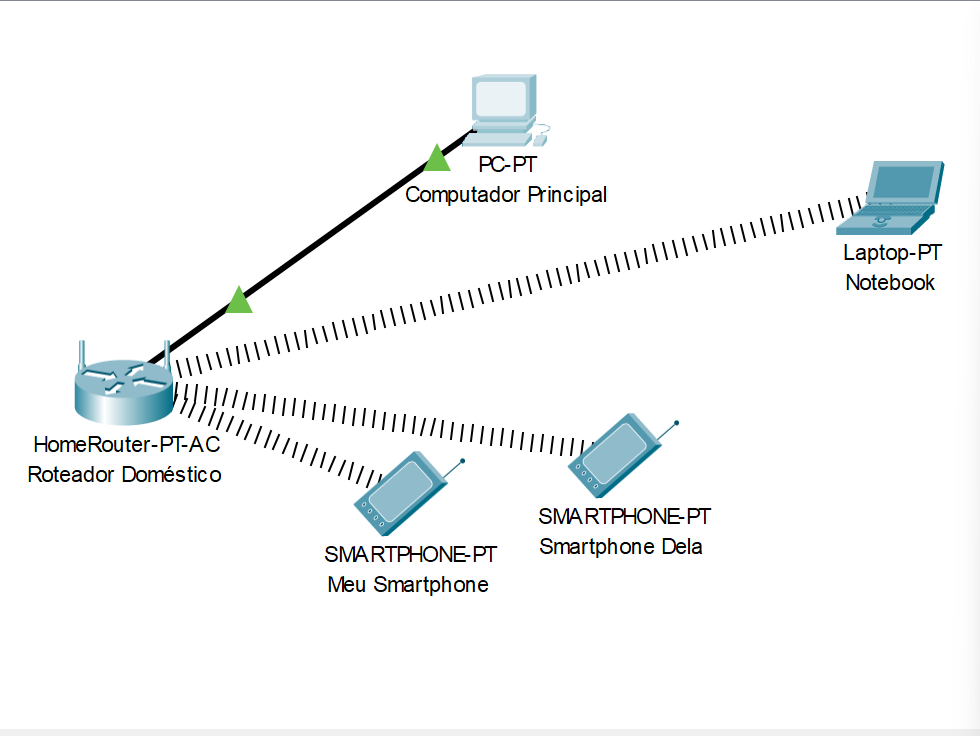
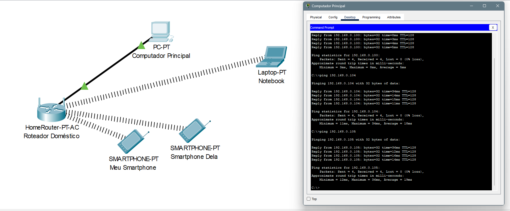
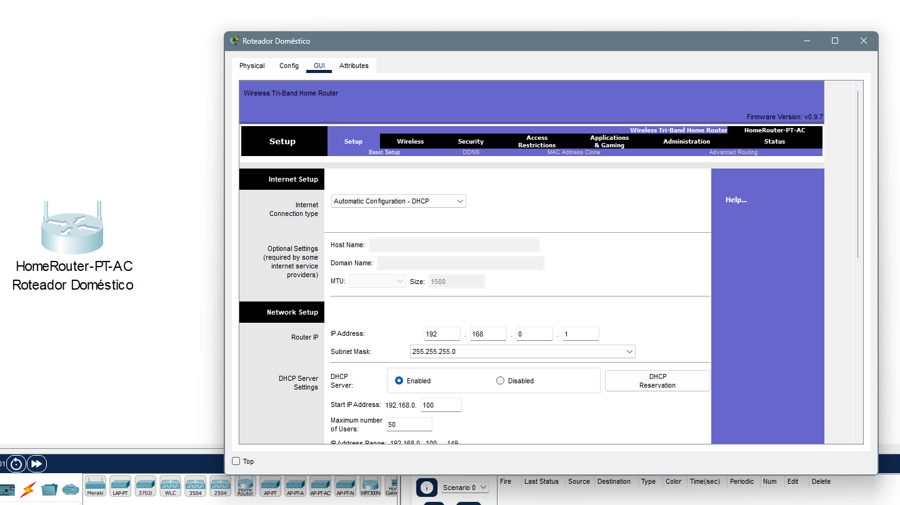

# Rede Doméstica Básica – Cisco Packet Tracer

## Descrição
Este projeto simula uma rede doméstica simples, com foco no entendimento de conexões cabeadas e Wi-Fi, configuração de DHCP e testes de conectividade.

---

## Topologia

- 1 Roteador Wireless (PT-AC)
- 1 PC via cabo
- 1 Notebook via Wi-Fi
- 2 Smartphones via Wi-Fi

---

## Configurações

### Roteador (PT-AC):
- DHCP ativado  
  Faixa: `192.168.0.100 – 192.168.0.150`
- Gateway padrão: `192.168.0.1`

### Dispositivos:

| Dispositivo  | Tipo de Conexão | IP (via DHCP)      |
|--------------|------------------|--------------------|
| PC           | Cabo             | 192.168.0.100      |
| Notebook     | Wi-Fi            | 192.168.0.103      |
| Smartphone 1 | Wi-Fi            | 192.168.0.104      |
| Smartphone 2 | Wi-Fi            | 192.168.0.105      |

---

## Testes Realizados

- `ping` entre todos os dispositivos
- Verificação de gateway (`ping 192.168.0.1`)
- Testes de conectividade e atribuição automática de IP (DHCP)

---

### Topologia da Rede (Packet Tracer)

### Terminal dos Testes com `ping`

### Interface de Configuração do Roteador

---

## 💡 Aprendizado

- Compreensão de redes locais
- Diferença entre conexões cabeadas e sem fio
- Funcionamento do DHCP e atribuição automática de IP
- Testes de rede básicos com `ping`
